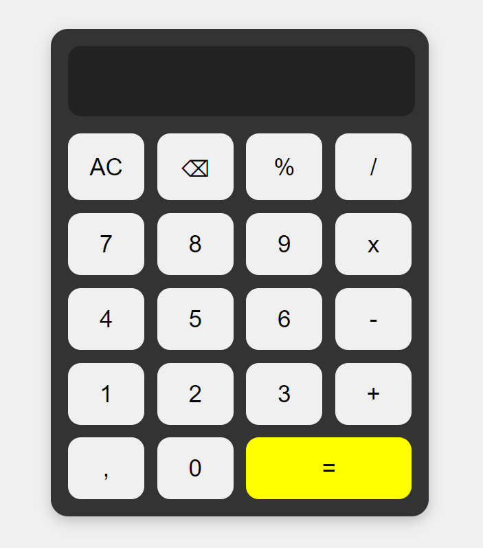

# Calculadora en TypeScript

Este proyecto es una **calculadora** básica escrita en **TypeScript** que permite realizar operaciones aritméticas fundamentales como suma, resta, multiplicación y división. La calculadora acepta entradas del usuario y devuelve el resultado de la operación seleccionada.

## Estructura del Proyecto

```bash
├── src
│   ├── index.ts    # Lógica principal de la calculadora
├── index.html          # Punto de entrada del programa
├── style.css           # Fichero de personalización
├── tsconfig.json       # Configuración de TypeScript
└── README.md           # Descripción del proyecto
'''
## Funcionalidades

- Suma
- Resta
- Multiplicación
- División (con manejo de división por cero)

## Vista de la Calculadora



## Contacto

- **Nombre:** Iván Bermejo Hidalgo
- **Email:** ibermejo@elpuig.xeill.net
- **GitHub:** [IvanBermejoHidalgo](https://github.com/IvanBermejoHidalgo)


